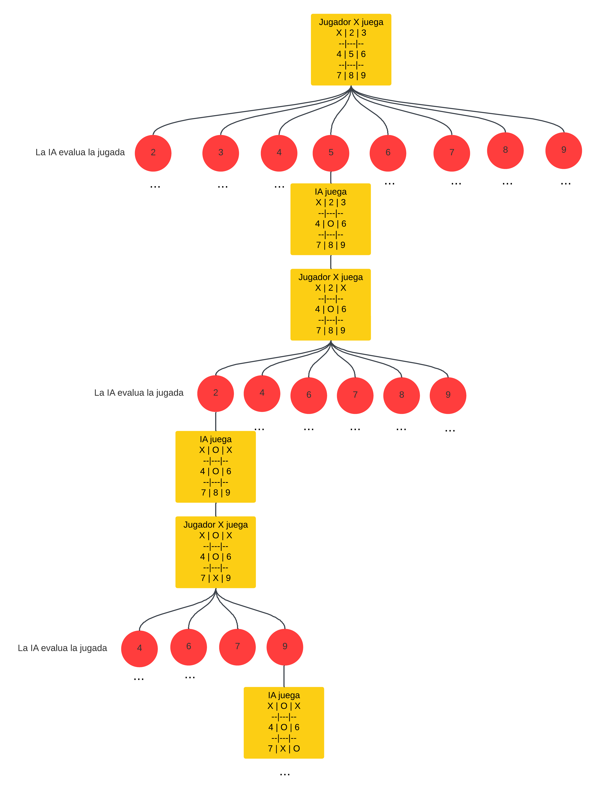

Integrantes:
Benjamin Pedro Rojas Espejo, 21.742.522-0, benjamin.rojas06@alumnos.ucn.cl, C1 
Benjamin Ignacio Torres Inostroza, 21.695.589-7, benjamin.torres04@alumnos.ucn.cl, C1
Instrucciones de Ejecución
Comando: g++ -o main main.cpp Tablero.cpp Cpu.cpp
Se recomienda usar un IDE com Visual Studio Code. Asegurese de tener configurado correctamente los archivos tasks.json y launch.json (deberían estar ya configurados). Si llega a tener errores usando un IDE, ejecute directamente el archivo main.exe.

Explicación del algoritmo
El codigo se divide en 3 clases:
    -Tablero: En esta clase se guarda el tablero. Además contiene todos los métodos necesarios para el juego, como mostrar el tablero, hacer movimientos, comprobar si un jugador ganó y si el tablero está lleno. El tablero en sí es una matriz de tipo char.
    -Cpu: Esta clase contiene los metodos de la IA, evaluar, minimaxPoda y mejorJugada, con las cuáles busca cuál es el mejor movimiento a hacer.
    -main: Instancia a las otras dos clases, y permite al usuario jugar al gato.

Algoritmo Minimax
Es un algoritmo utilizado para tomar la mejor decisión en juegos de 2 jugadores de suma cero. En palabras simples busca minimizar la posible máxima perdida.
Función:
    -Representación de las jugadas como un árbol
    -Se alternan turnos, en donde se busca que el jugador MAX tenga la mayor puntuación posible, y el jugador MIN tenga la menor.
    -Se recorre el árbol hasta las hojas, donde se evalúa, en el caso de este ejercicio, de la siguiente manera:
        +10 puntos si gana la IA
        -10 puntos si gana el Jugador
        0 si es empate
    -Se guarda cúal es el movimiento que conduce al resultado con mayor puntuación.

Poda Alfa-Beta
Es una optimización del Minimax. Reduce la cantidad de nodos recorridos sin alterar el resultado.
-Alfa:
El mejor valor que el jugador "Max" puede garantizarse en el camino actual.

-Beta:
El mejor valor que el jugador "Min" puede garantizarse en el camino actual.

Condición de poda:
Si se detecta que un nodo no mejora el resultado actual, se deja de explorar.

Diagrama de árbol para las primeras 3 decisiones de la IA

Complejidad temporal antes de aplicar poda

En cada turno, la IA recorre el arbol completo, por lo que la complejidad, en cada turno, sería:

!a, donde a es la cantidad de movimientos posibles. 

En este juego en particular, y si tomamos en cuenta que en el primer turno de la IA hay 8 posibles movimientos, entonces, en el peor caso (Que sería que no gane ninguno, y se comlpete el tablero), la complejidad sería:
8! + 6! + 4! + 2! = 41,066 nodos explorados

Complejidad temporal despues de aplicar poda

Al hacer distintas pruebas, se vió que se exploraron entre 2500 y 3000 nodos en los peores casos, lo que indica una reducción de casi un 95% de nodos explorados. Esto muestra la efectividad de la poda alfa-beta.
